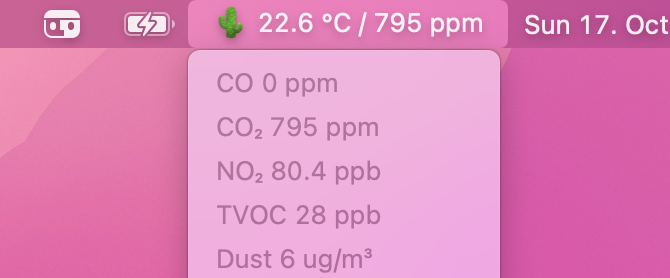

# AirQ

Access uHoo Air data stored in your account.



## Run

```
$ git clone git@github.com:jererobles/airq.git && cd airq
$ poetry install
$ poetry run python src/__init__.py
```

AirQ will create a `session` file in the app directory to keep refresh tokens and avoid unnecessary requests to the uHoo API.

## Statuses

| Emoji | Caused by             | Comments                           |
| ----- | --------------------- | ---------------------------------- |
| ☺️    | –                     | All OK                             |
| 🤢    | Carbon dioxide        | Open the windows                   |
| 🌵    | Low humidity          | Turn on humidifier                 |
| 💦    | High humidity         | Turn on AC                         |
| 😷    | Dust                  | Do some cleaning                   |
| 😣    | Negative air pressure | Open a window                      |
| 😖    | Positive air pressure | Turn off ventilation               |
| 🫁     | Red-brown gases       | Get some fresh air                 |
| 😵    | Various factors       | Air is bad                         |
| ☠️    | Carbon monoxide       | Air is poisonous                   |
| 🦠    | Various factors       | "Virus Index" triggered            |
| ❌    | App error             | Connectivity issues or API changes |

## TODO

- [x] create initial login script by reversing authentication
- [x] create class to interface with API
- [x] use sessions to avoid handling cookies manually
- [x] persist session after script terminates
- [x] do something with data
- [ ] make binaries
